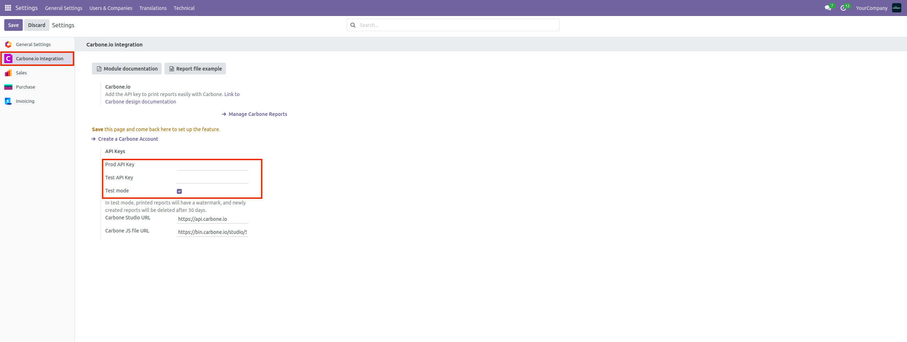
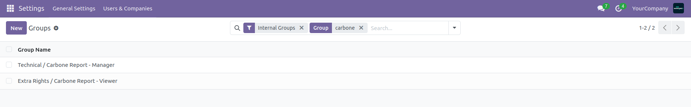
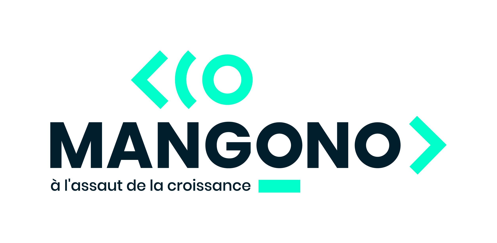

.. image:: https://img.shields.io/badge/license-LGPL--3-blue.svg
    :target: http://www.gnu.org/licenses/lgpl-3.0-standalone.html
    :alt: License: LGPL-3

Carbone Odoo Connector
======================
Carbone Odoo Connector system for Odoo 19 Community edition.

Configuration
=============

Add your Carbon API keys and define users who have access to the "Carbon Reports" menu with the "Carbon Report - Viewer" and "Carbon Report - Manager" groups.

Company
-------
* `Mangono <https://mangono.fr/>`__

License
-------
General Public License, Version 3 (LGPL v3).
(http://www.gnu.org/licenses/lgpl-3.0-standalone.html)

Credits
-------
Developer: (V19) Mangono , Contact: contact@mangono.fr

Contacts
--------
* Mail Contact : contact@mangono.fr
* Website : https://mangono.fr

Bug Tracker
-----------
In case of trouble, please contact us via our email address.

Maintainer
==========

This module is maintained by Mangono.

For support and more information, please visit `Our Website <https://mangono.fr/>`__

Further information
===================
HTML Description: `<static/description/index.html>`__
