:toc:

= Guide to creating a Carbone report in Odoo

== Creating an export template

[NOTE]
====
This section is not mandatory for setting up a Carbone report, since by default, when creating a report for the first time with an Odoo X model (sale.order, purchase.order, etc.), a "Global" export is created for the model in question.
This export model retrieves all fields visible in the list and form views of the Odoo model in question.
However, it may be necessary to create your own export model in order to retrieve other fields not displayed in the interface.
====

For this example, we assume that we want to create a report based on data from a purchase order.

You need to go to the list view of the desired universe, in this case "Purchase".

Select any record, then click on "Actions" and then "Export".

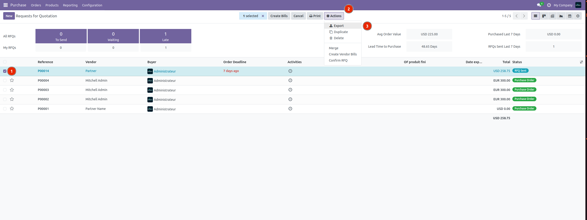

In the pop-up window that opens, tick "JSON" in the "Export format" field.

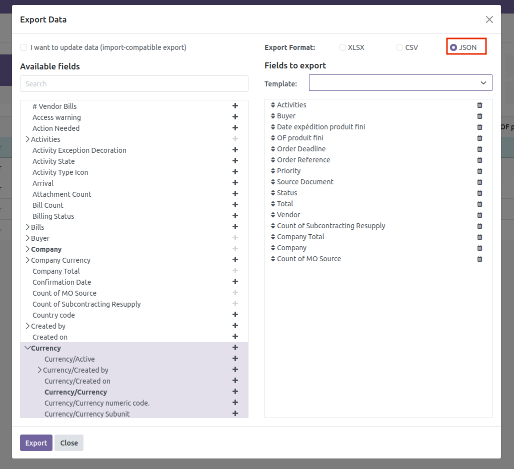

Select the fields you want to include. Once you have done this, save your export template.
From the list, select "New template". Name your export template, then save this new export template.

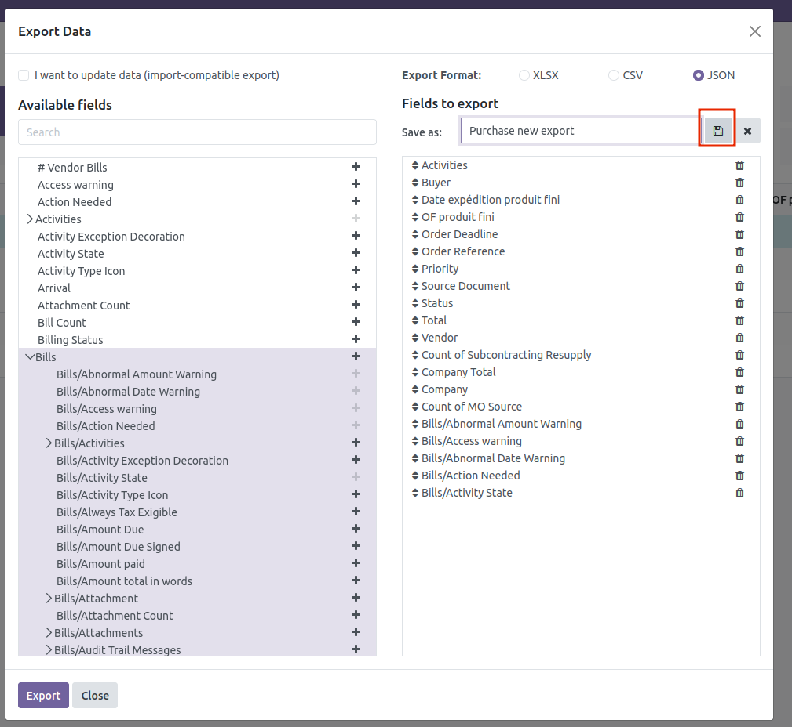

In order to more easily find the name of the model from which we are extracting our data (in our example, purchase orders), we will click on "Export".

This will allow us to identify, first of all, whether the data extracted in the new file meets our needs, and secondly, the file name displays the name of the Odoo model (here "Purchase Order") and the technical name of the model (here "purchase.order").

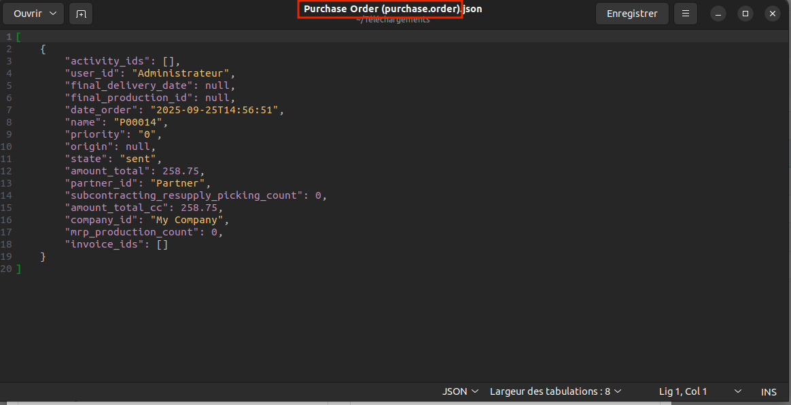

== Creating a new Odoo report

In the list of universes, click on the "Document Generation" menu, then on the "New document" button.

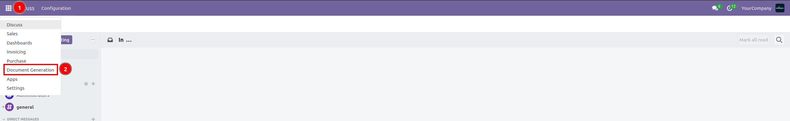

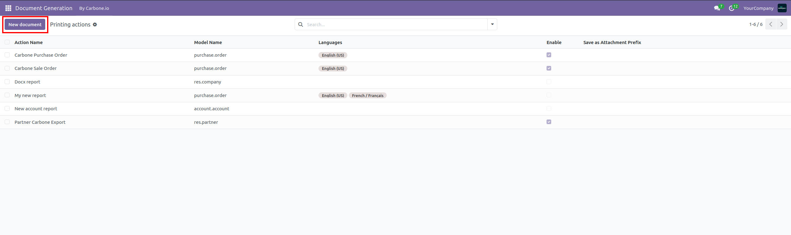

A pop-up appears, allowing you to fill in the first mandatory fields when creating a report.

- Action name :
    Name that will be displayed in Odoo when clicking on the "Print" button, when it is possible to print the report.

- Odoo model name :
    Name of the Odoo model on which the report data should be based.

- Carbone Template ID :
    Unique identifier generated when adding a file to your Carbone account, or in Odoo. (Not required if an extension is used)

- Report extension :
    Extension of the input report. (Not mandatory if a Carbone Template ID is specified)

For now, the data to be entered are the fields "Action name", "Odoo model name", "Carbone Template ID" or
"report extension".

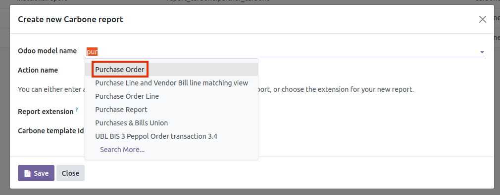

[NOTE]
====
You must have either a Carbone Template ID or a report extension, but not both at the same time.
====

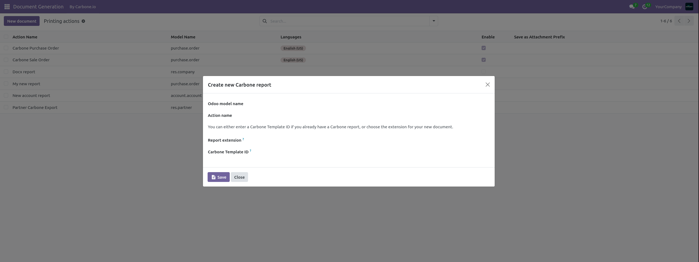

On the left, we find fields from our report to be defined, and on the right is a Carbone Studio, directly integrated into Odoo.

You can see that the Carbone Template ID is already filled in, and that the studio has initialised itself with a file of the extension that you previously selected in the pop-up.

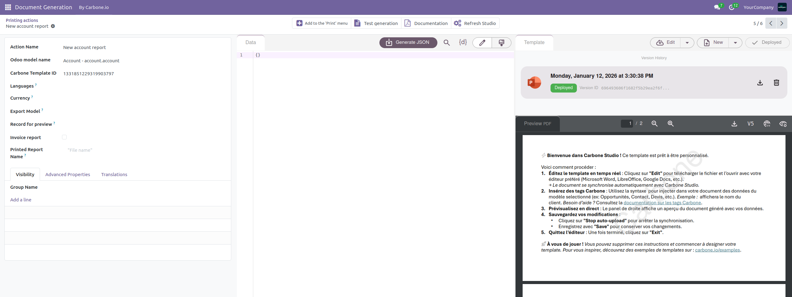

- Export Model :
    Name of the export template to use to retrieve the data required for the report.

- Printed Report Name :
    Name that will be given to the generated PDF report. Leave blank if there is no specific report name to be set.

[NOTE]
====
When creating a new document, a "Global" export template is automatically created for the "Odoo model name" used. By default, it contains the exportable fields displayed in the list and form views of the model. It is systematically named "Global Export For Carbone", followed by the name of the model displayed in the interface.
====

For our example, we will use our own export template created previously.

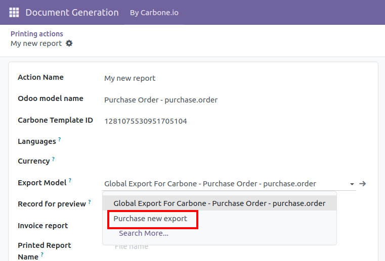

Once our Odoo model name has been defined, a record will automatically be assigned to the "Record for preview" field. This field allows us to choose a record belonging to the Odoo model on which to export information, to help us create our file from real data.

When you click on the "Refresh Studio" button, the recording data will be automatically copied and pasted into the studio.

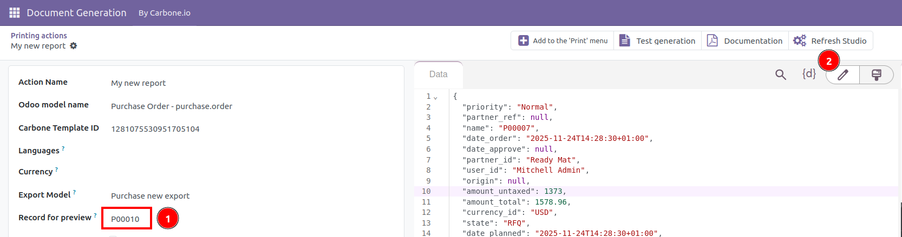

== Creation of the document (.odt, .docx, etc.)

Now that we have created our first draft Odoo report, we can start creating our document. Carbone will use this future document to display our data exported from Odoo.

You can either download the file already uploaded to Carbone directly in Odoo via the ‘Edit’ button.
If your browser is compatible with live upload, simply open the downloaded file and
save the changes locally so that they are directly reflected in Odoo.

Otherwise, you will need to drag and drop the downloaded file into the ‘Drag and drop your template here’ area.

[NOTE]
====
You can also click on "New" and then select your file from the file explorer that will be displayed.
====

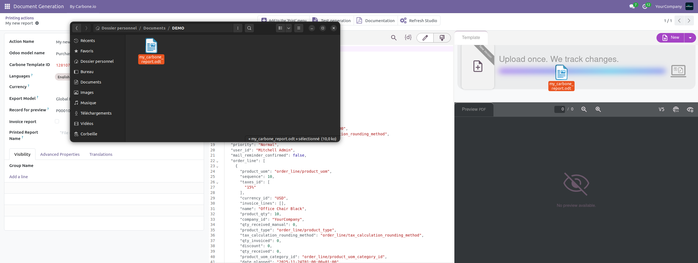

Once the file has been added to the studio, it will become visible, with a "Carbone" watermark.

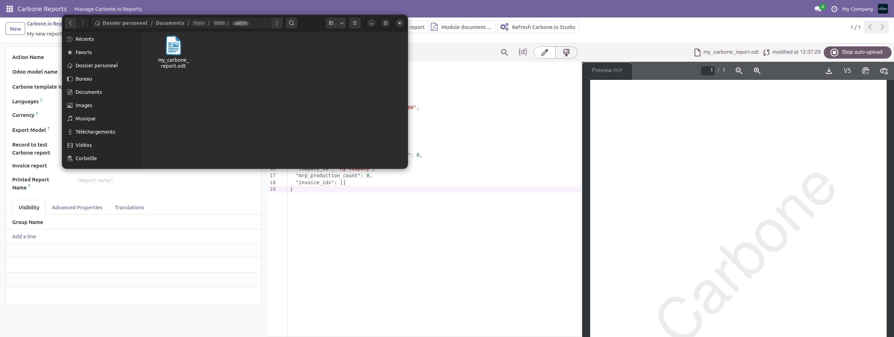

As long as the file is active in the studio, any changes made to the file on your computer will automatically be displayed in the studio after saving.

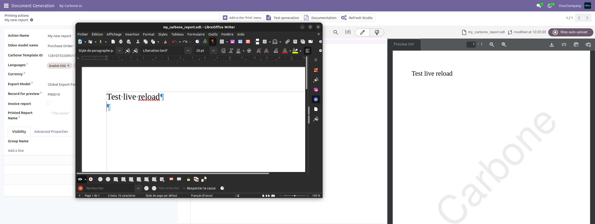

We can now display the JSON data in our file.

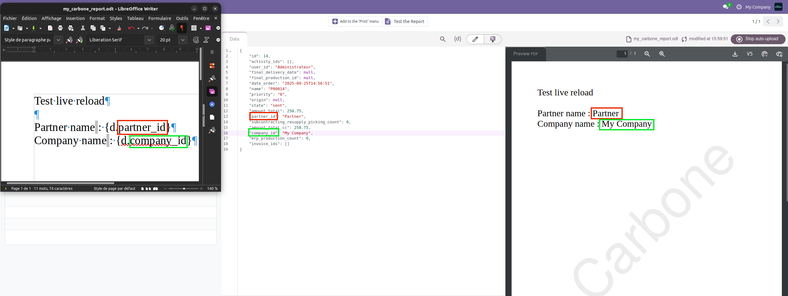

== Add the document to Carbone

[NOTE]
====
This section is not mandatory if you created your Odoo report directly from Odoo,
by choosing one of the three extensions (docx, pptx, xlsx).
====

Now that our file is configured, we can add it to Carbone.

After logging into our Carbone account and clicking on the "Open Studio button, then "Start from Scratch",

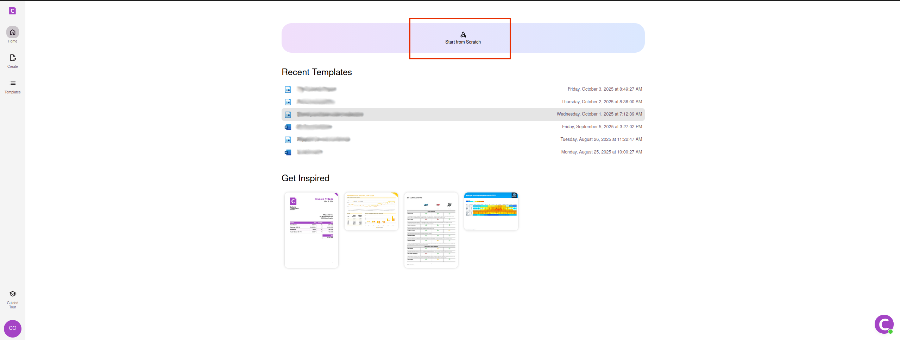

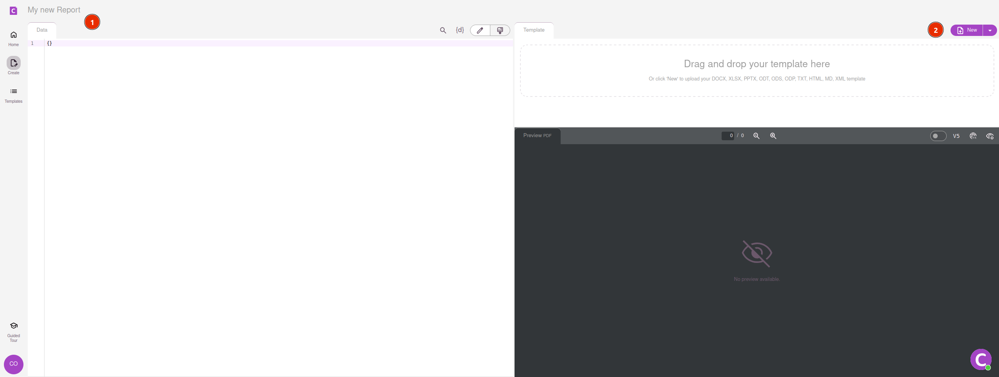

A page will open. Enter a template name in the top left corner of the window, and open the desired odt/docx file using the "New" button on the right side of the window.

Once the file has been uploaded, click on the "Save" button, which will save our new Carbone Report.

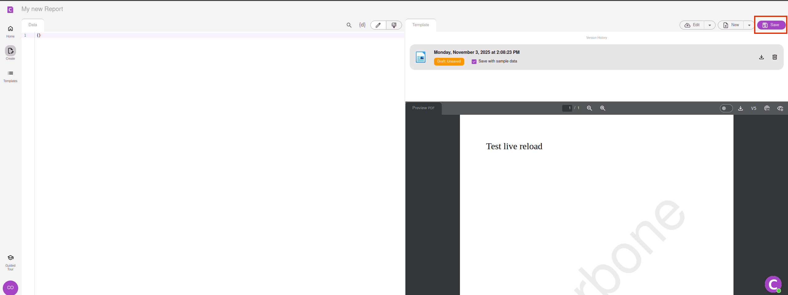

After creating the new template, click on the "Template ID" button to copy the Carbone ID of your report to the clipboard in the "Carbone Template ID" field on the Odoo side.

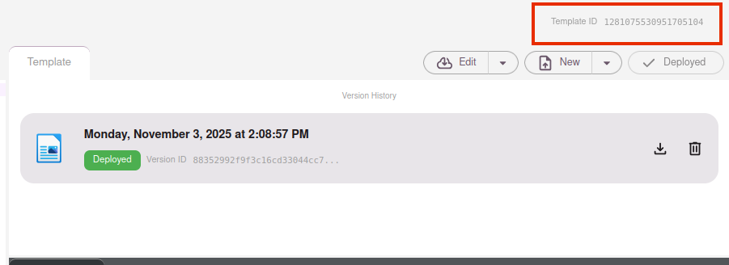

Once the ID has been entered, you can now add your new Odoo report to the list of printable reports for the "Purchase order" template by clicking on the "Add to “print” menu" button.

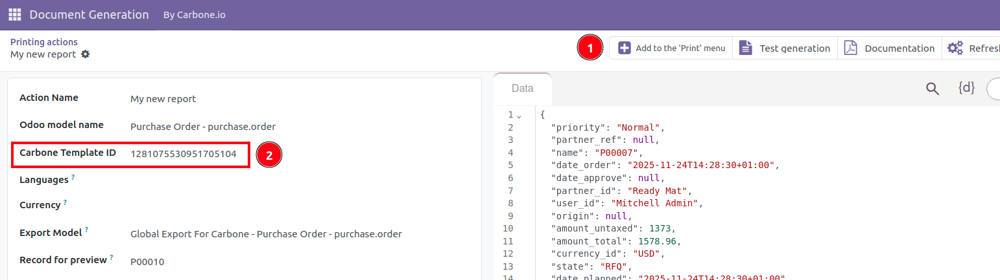

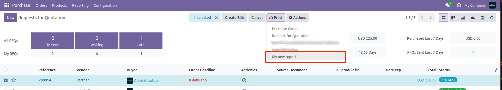

When the "Carbone Template ID" is filled in from Carbone's "Template ID", this information is no longer required to be modified in the Odoo backend.
You can manage your different report versions in Carbone or Odoo and choose which version should be effective via the "Deploy" button.

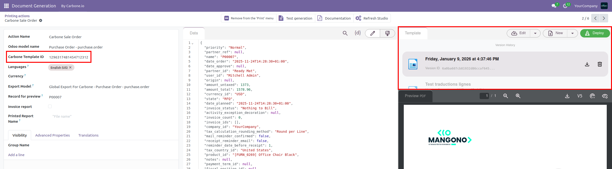

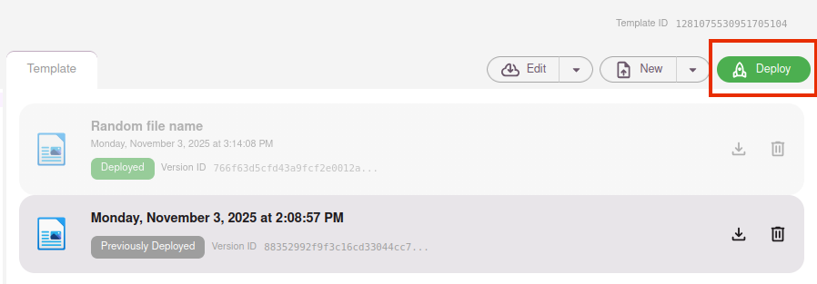

The version printed in Odoo will always be the one deployed.

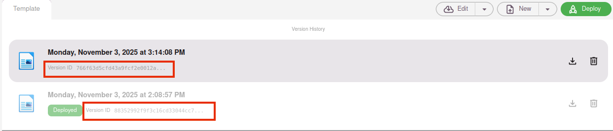

[WARNING]
====
It is important to copy the ‘Template ID’, not the ‘version ID’, in order to access the report history and
deploy these reports directly from Odoo.
If a ‘version ID’ is entered, an information message will appear, and the studio will not be functional.
However, report printing will still be operational, and it will be the template linked to the ‘Version ID’ that will
be printed.

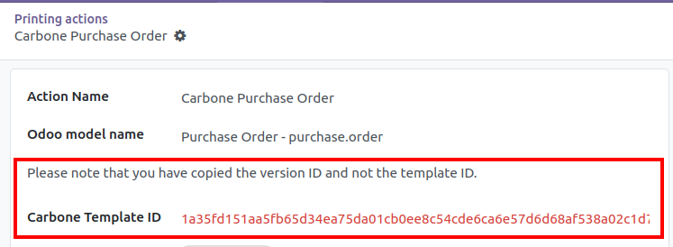
====

== Edit a template

If you wish to modify an existing file in Carbone, best practice is to create a new version of the file.

To do this, first retrieve the .odt/.docx or other file associated with the Carbone report.

Either via Carbone Studio:

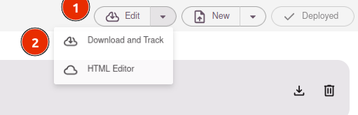

Either directly in Odoo, using the same button:

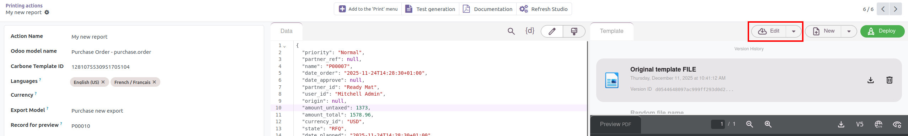

In the Carbone studio (or the one displayed in Odoo), we create a new version of the report using the "New" button.

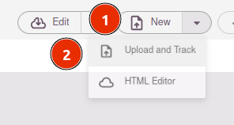

Once the changes to the file have been made locally, you can click on "Save" again, and a new Carbone report associated with a new "Version ID" will be generated.

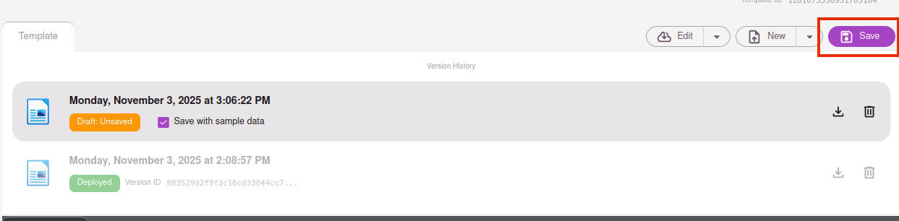

This way, the first version, which may still be in production, remains usable until the new version is deployed.

To use a specific version, simply click on the desired template in Carbone, then "Deploy".

== Currency management

To display a specific currency in a report, you must fill in the "Currency" field.
By default, if no currency is specified, the currency used will be the one available in the Odoo template, if that template has a "currency" field. Otherwise, the currency defined at the company level is used, which can be configured in "Settings > Users & Companies > Companies".

== Language and translation management

=== Translations

It is possible to add translations to a Carbone report, which will be displayed in the report, depending on the language of the report.

For non-dynamic information in a report (title, paragraph, table column name, etc.), the text must be enclosed in the "{t(my_text)}" tag.

To add a translation, click on the "Translations" tab, then add a language.

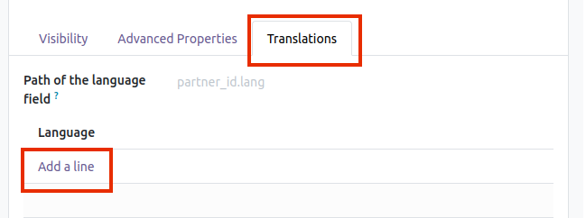

The available languages will be those installed in Odoo.

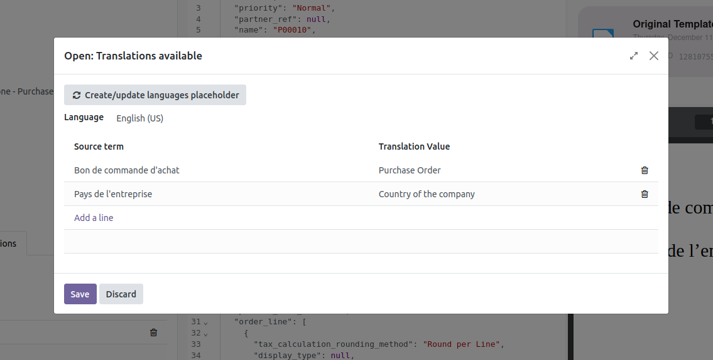

The "Create/update languages placeholder" button allows you to quickly copy/paste "source terms" from the current language into all other translations of the report, if these "source terms" are not present in the other languages. These translations will be created without a "Translation Value".

[WARNING]
====
The text of the report must be copied and pasted correctly into Odoo to maintain the correct typography, depending on the different quotation marks, apostrophes, etc. Otherwise, the translation will not be effective.
====

Previously added translations will be visible directly in the embed studio by clicking on the "{d}" button (1) and then selecting the translation data via "{t}".
To view the translation in real time, simply change the studio language using the second button (2) in the screenshot and select the target language from the list (3).

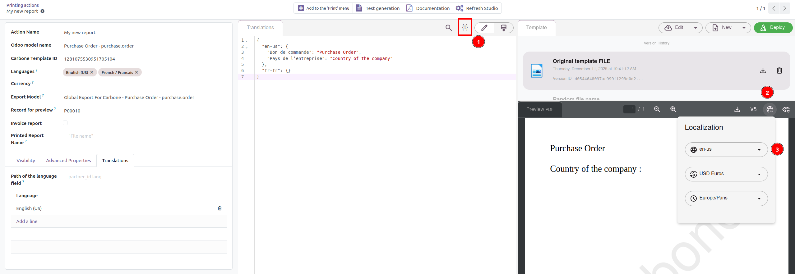

As for the dynamic information in the report, retrieved via the data available in Odoo, if the report does not contain any languages or only one language in the "Languages" field, the information is directly translated according to the language entered, or the user's language if no language is defined.

The translations are those defined in Odoo.

[cols="a,a"]
|===
|image::../static/description/assets/screenshots/translate_in_data_en_us.png[]
_Data translated into English_
|image::../static/description/assets/screenshots/translate_in_data_fr_fr.png[]
_Data translated into French_
|===

When the report is available in more than one language,
for example English and French, the data with translations will be replaced by a key that leads to a value in the translation dictionary, visible via the "{t}" button.

It contains translations for each language, for terms
entered manually and for terms translated automatically using Odoo's native translations.

[cols="a,a"]
|===
|image::../static/description/assets/screenshots/translate_with_key.png[]
|image::../static/description/assets/screenshots/translation_avaible_in_t_data.png[]
|===

=== Languages

The language settings for the report can be configured in several ways:

- You can define the print language in relation to another 'language' field in the template from which the information is retrieved, via the "Translations" tab, then "Path of the language field".

For example, for purchase orders, it is possible to print reports based on the customer's language by entering the Python path to the lang field, in this case `partner_id.lang`.

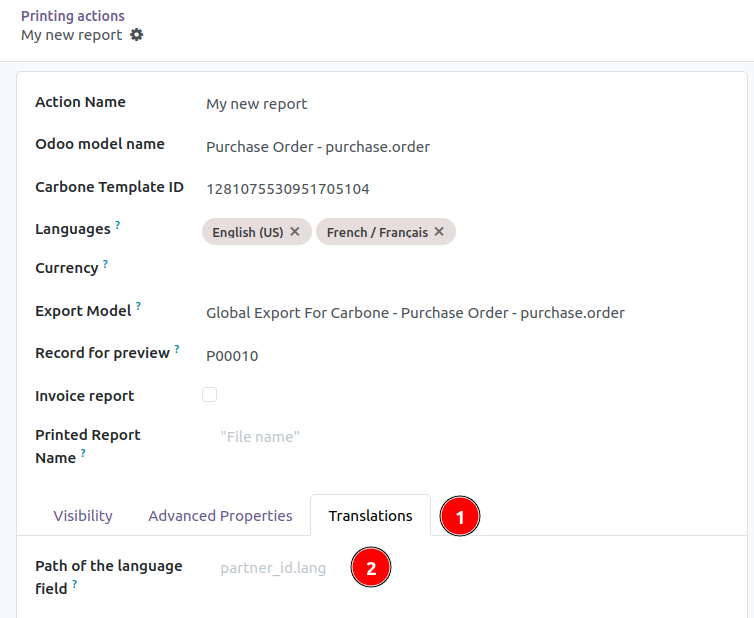

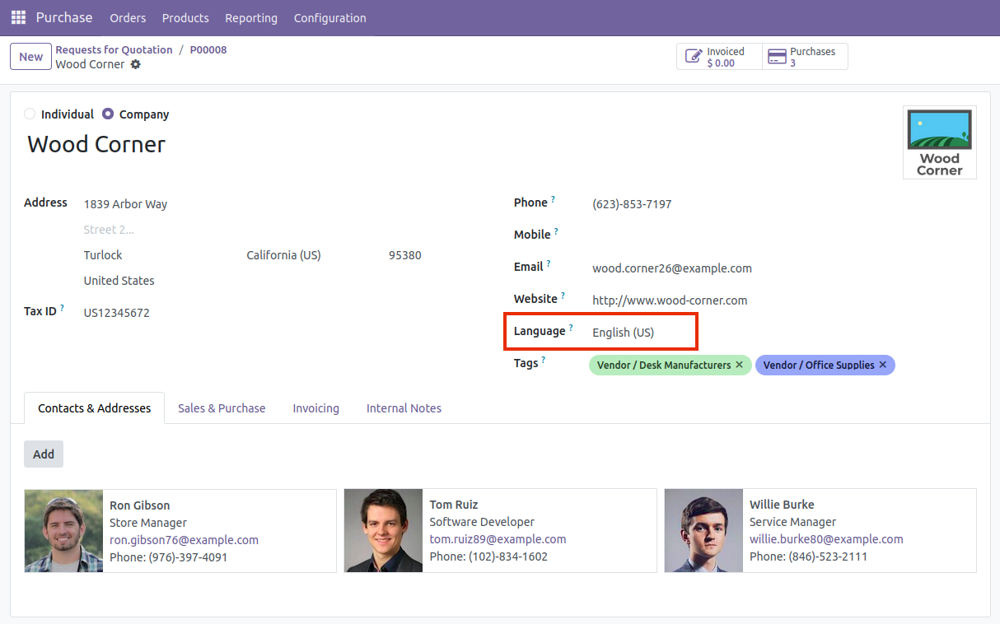

- Also via the "Languages" field. If nothing is defined in this field, the print language will be the language of the user printing the report. If several languages are defined, the chosen language will be the first `res.lang` in Odoo.

== Nested template

If you are using Carbone's appendTemplate feature, to access your variables in complement ({c.}) instead of data ({d.}), you must check the “Use complement datas” box in the Advanced Properties tab.

== User groups and rights

You can define which user(s) will be able to view or edit Carbone Reports via two new groups: "Carbone Report - Manager" and "Carbone Report - Viewer".

The "Manager" group allows users to modify Carbone reports and access the "Carbone Reports" menu.

The "Viewer" group allows users to access Carbone reports in read-only mode; no modifications are possible.
